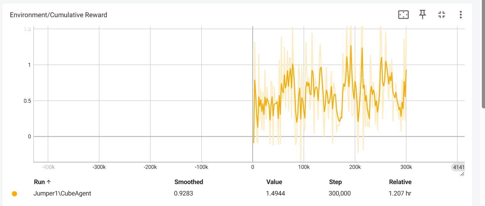
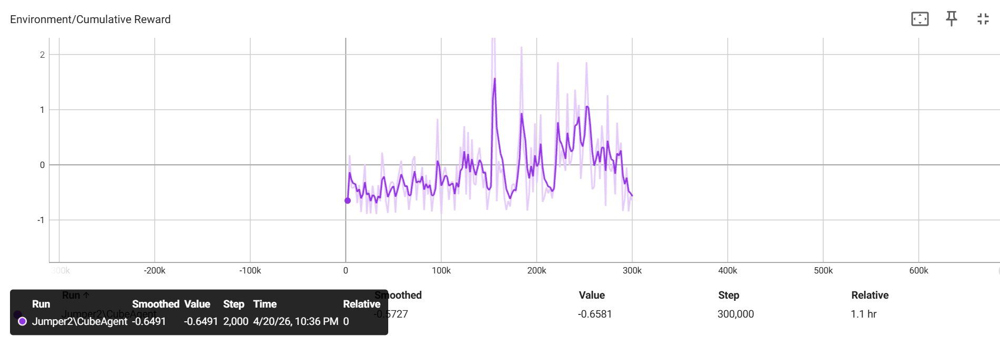
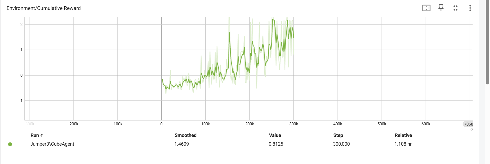
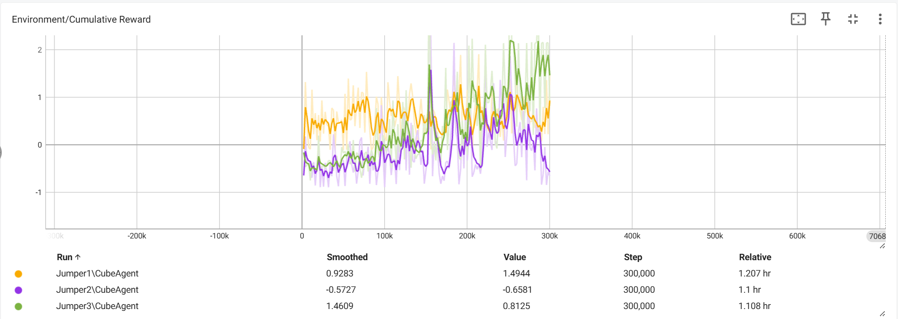

# Analyse van rewardaanpassingen bij ML-Agent Jumper

| S-nummer |
| --- |
| s133070 |

## Inleiding

In dit verslag wordt geanalyseerd hoe de ML-agent Jumper reageert op verschillende rewardstructuren. De agent wordt meerdere keren opnieuw getraind met kleine aanpassingen in de rewardsysteem, zo kunnen we de beste rewardsysteem vinden voor deze oefening.

De agent heeft als doel:

- Obstakels ontwijken door op het juiste moment te springen.
- Munten verzamelen wanneer mogelijk.
- Zo lang mogelijk overleven zonder fouten te maken.

## Methoden

Dus de agent zal telkens andere rewards krijgen, zodat we via tensorboard kunnen analyseren welke 'run' het beste was.

- Positieve reward per step.
- Negatieve reward bij fouten (obstakels raken, te ver afwijken).
- Reward voor het verzamelen van munten.
- Balans tussen positieve en negatieve feedback.

We hebben gekozen om telkens 300.000 stappen te nemen per training sessie. Er is ook gekozen voor telkens een kleine positieve reward toe te dienen aan de agent zodat de agent door heeft dat het vermijden van de obstakels positieve reward geeft.

## Run 1 - Te hoge step reward

### Configuratie

- Step reward: +0.001
- Obstakel: -1.0
- Afwijken: geen straf
- Coin: +3.0

### Resultaten

De agent leert relatief snel en behaalt stabiele positieve rewards. De grafiek toont een duidelijke stijgende trend in het begin, maar bereikt daarna een plateau. De agent had te vaak een positieve reward en het verschil tussen iets negatief en positief doen was te groot.

## Run 2 - Te lage reward en te zware straf

### Configuratie

- Step reward: +0.0002
- Obstakel: -1.0
- Afwijken: -0.5
- Coin: +3.0

### Resultaten

De prestaties verslechteren sterk. De agent behaalt gemiddeld negatieve rewards en vertoont geen duidelijke stijgende trend.

Dit toont aan dat:

- Dat het verschil tussen de positieve en negatieve rewards nog niet goed zat.
- De agent zal door het verschil slecht/onstabiel bijleren

Zoals je kan zien, breekt de agent door in het positieve vanaf 150k steps, maar net voor het einde ging de trend terug richting een opeenvolging van negatieve rewards.

## Run 3 - Gebalanceerde positieve/negatieve rewardstructuur

### Configuratie

- Step reward: +0.0005
- Obstakel: -1.0
- Afwijken: -0.2
- Coin: +1.5

### Resultaten

De agent behaalt de beste resultaten. Je kan dit ook waarnemen in de grafiek:

- Een duidelijke stijgende trend.
- Hogere pieken dan vorige runs.
- Stabielere prestaties op lange termijn.

De agent leert efficienter gedrag en blijft verbeteren tot het einde van de training, zonder een terugkerend dalende trend.

## Vergelijking van de runs

- Run 1: snelle learning, maar slechte afstraffingen.
- Run 2: learning faalt door slechte rewardbalans.
- Run 3: beste balans van alle runs met de best strijgende trend.

## Conclusie

Uit de resultaten kan geconcludeerd worden dat de balans tussen positieve en negatieve rewards een cruciale rol speelt in het leerproces van de agent voor een mooie lineare trend te krijgen.

Een te hoge positieve reward per step (Run 1) zorgt ervoor dat de agent voornamelijk leert overleven, maar beperkt blijft in zijn gedrag.

Een te lage reward gecombineerd met zware straffen (Run 2) verhindert het leerproces volledig, omdat de agent te weinig beloond word.

De beste resultaten worden behaald in Run 3, waarbij een gebalanceerde rewardstructuur werd toegepast:

- Step reward: +0.0005
- Obstakel: -1.0
- Afwijken: -0.2
- Coin: +1.5

Deze configuratie biedt voldoende positieve feedback om te leren, terwijl fouten nog steeds duidelijk bestraft worden. Dit resulteert de beste stabiele en stijgende leercurve.
