# Analyse van hyperparameter-aanpassingen bij ML-Agent Oblix (rapport)

| S-nummer | s133070 |

## Inleiding

In dit verslag wordt er geanalyseerd hoe de ML-agent 'Oblix' reageert op verschillende aanpassingen in observaties, episode-lengte en PPO-hyperparameters. De agent wordt meerdere keren opnieuw getraind met kleine wijzigingen, zodat kan worden geanalyseerd welke configuratie de beste en meest stabiele resultaten oplevert voor de volledige taak juist uit te voeren.

Het doel van de agent is:
1. Een steen ophalen.
2. Deze naar de afleverlocatie brengen.
3. Dit proces herhalen tot alle stenen gebracht zijn naar een afleverlocatie.

Tijdens het testen wordt telkens een nieuwe training gestart vanaf nul. De resultaten worden geëvalueerd op basis van de TensorBoard grafiek **Environment / Cumulative Reward**.

## Methoden

De agent wordt meerdere keren opnieuw getraind met verschillende configuraties. Bij elke training worden volgende zaken aangepast en geëvalueerd:

- Observaties
- Episode-lengte (Max Step)
- Rewardstructuur
- PPO hyperparameters (beta, learning rate, batch size) <-- deze heb ik veranderd om te kijken wat    het kan doen met de zelfde script of het beter kan leren.
- Reproduceerbaarheid van resultaten (kijken of het geen 'lucky' resultaat was door de zelfde config en settings te gebruiken en een nieuwe training te starten).

Alle trainingen worden uitgevoerd tot 100k, 250k of 300k stappen. De grafieken worden telkens vergeleken. Dit hing af van de resultaten, als ik pas tegen 100k stappen een positieve verandering zag dan liet ik de agent langer doortrainen.

---

## Basisconfiguratie (Stap 9)

De baseline configuratie bevat:
- Observaties:
  - positie agent
  - boolean of steen wordt gedragen
- Continuous actions: 2
- Straf per frame: -0.0002f
- PPO standaard configuratie
- Max Step: 3000

Deze configuratie wordt gebruikt als referentiepunt voor verdere experimenten.

## Resultaten

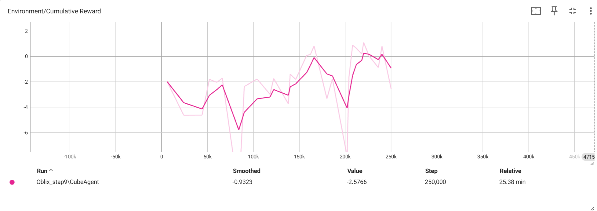

Bij deze configuratie leert de agent het gedrag gedeeltelijk. Er zijn positieve rewards zichtbaar, maar het gedrag blijft instabiel. De agent ontdekt soms de juiste strategie, maar behoudt deze niet consequent.

---

## Toevoegen van transform.forward observatie (Stap 10)

Er wordt een extra observatie toegevoegd:
- richting waarin de agent kijkt, dit ging misschien helpen naar wat de agent juist moet toe gaan.

Totale observaties verhogen hierdoor.

## Resultaten

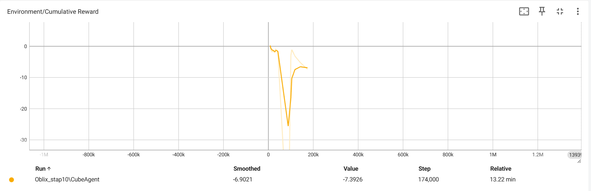

De resultaten tonen dat het toevoegen van deze observatie geen verbetering oplevert. De grafiek blijft instabiel en de agent leert niet sneller dan bij de vorige testen.

Hieruit kan geconcludeerd worden dat extra observaties niet noodzakelijk leiden tot betere prestaties. Dus hebben we deze nadien weer weg gehaald.

---

## Toevoegen van velocity observatie (Stap 12)

Er wordt een extra observatie toegevoegd:
- rigidbody velocity (hiermee kunnen volgen hoe de agent beweegt).

## Resultaten

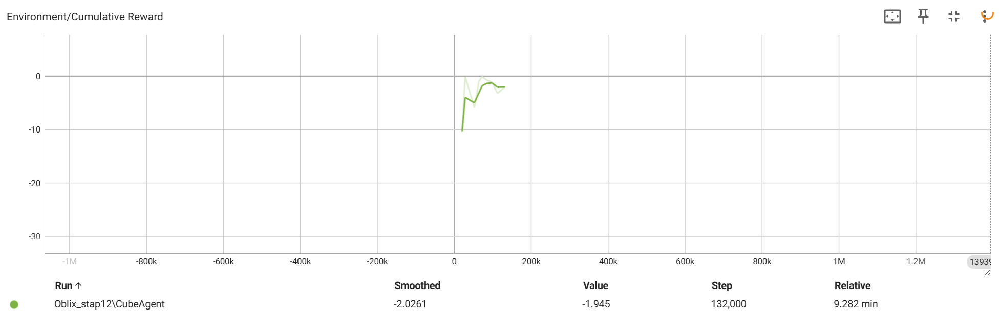

De agent leert iets stabieler, maar de prestaties verbeteren niet significant. De gemiddelde reward blijft beperkt en er ontstaan geen duidelijke doorbraken. Ook krijgen we vaak de melding dat er geen volledige episode is geëindigd.

---

## Terug naar baseline observaties (Stap 13)

De extra observaties worden verwijderd en de configuratie wordt opnieuw getest.

## Resultaten

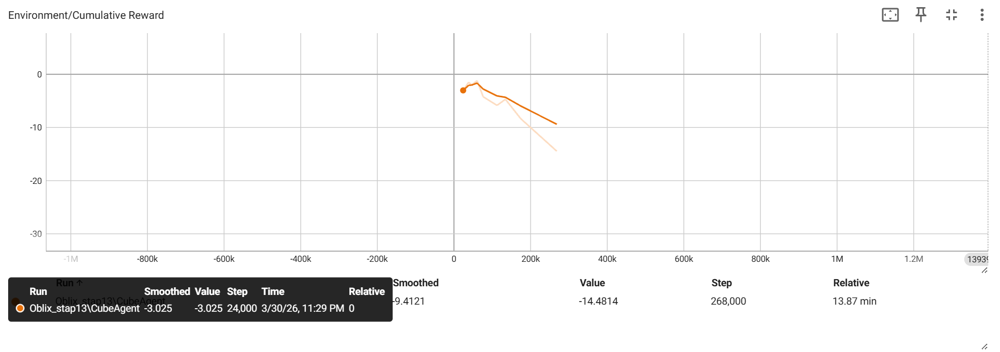

De prestaties blijven vergelijkbaar met de oorspronkelijke baseline. Dit bevestigt dat extra observaties niet noodzakelijk een voordeel bieden in deze omgeving. Waardoor we dus andere variabele moeten gaan aanpassen.

---

## Aanpassen van PPO hyperparameters (Stap 14)

De volgende configuratie wordt getest:

- batch_size: 128
- buffer_size: 4096
- learning_rate: 1.0e-4
- beta: 1.0e-3
- gamma: 0.99

## Resultaten

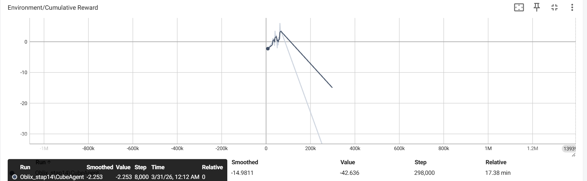

De agent leert iets stabieler, maar de prestaties blijven wisselend. Er worden positieve rewards gehaald, maar geen consistente verbetering. Ook na het behalen van een positieve rewards gaat het drastisch dalende resultaten weergeven.

---

## Verhogen negatieve reward (Stap 15)

De straf per frame wordt verhoogd naar:
- -0.001

## Resultaten

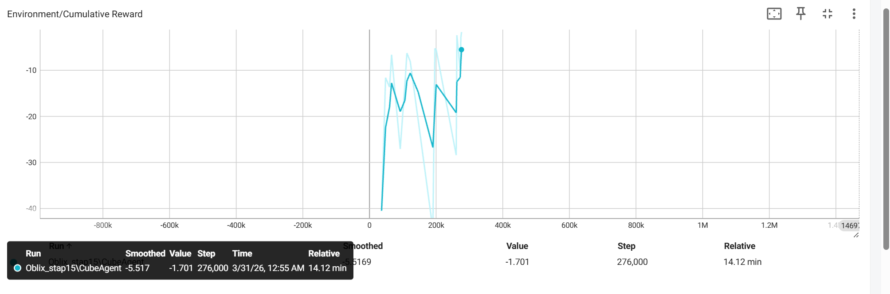

De prestaties verslechteren. De agent behaalt alleen negatieve rewards en leert moeilijker. Dit bevestigt dat een te grote negatieve reward het leerproces verstoort.

---

## Episode lengte verhogen (Stap 17)

De Max Step wordt verhoogd van:
- 3000 → 8000

## Resultaten

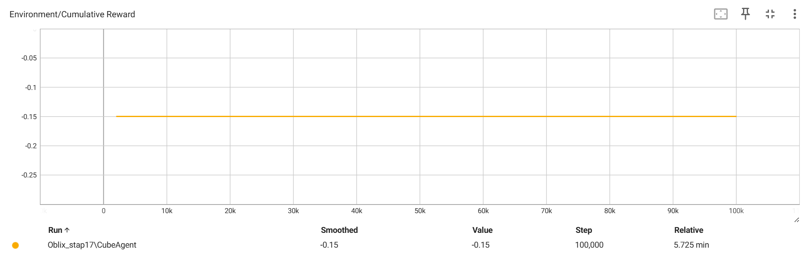

De agent haalt maar 1 consistente resultaat maar deze is negatief.

---

## Eerste succesvolle configuratie (Stap 18)

Met:
- Max Step = 8000
- learning_rate = 1.0e-4
- beta = 1.0e-3

## Resultaten

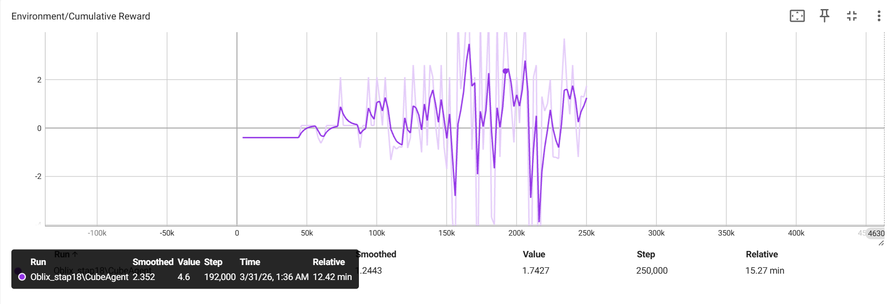

De agent behaalt meerdere positieve rewards. Dit is de eerste configuratie waarbij duidelijke doorbraken zichtbaar zijn. Het gedrag blijft echter nog instabiel. Dus moeten er nog veranderingen gebeuren.

---

## Verlagen beta (Stap 20)

Beta wordt aangepast:
- 1.0e-3 → 5.0e-4

## Resultaten

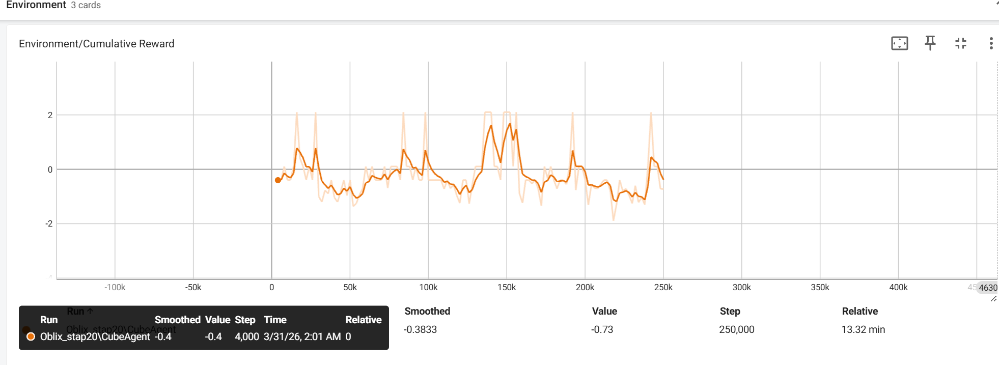

De agent behaalt opnieuw positieve rewards. Het gedrag wordt iets stabieler, maar de prestaties blijven te veel schommelen.

---

## Verlagen learning rate (Stap 21)

learning_rate wordt aangepast:
- 1.0e-4 → 5.0e-5

## Resultaten

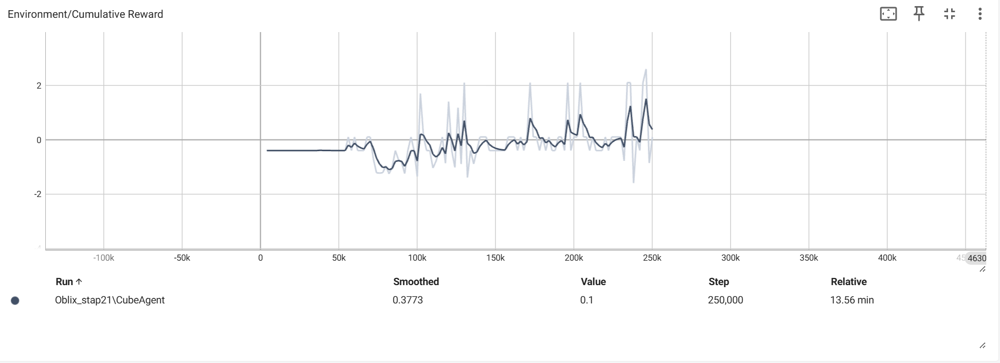

De training wordt stabieler maar ook trager. De agent leert minder efficiënt en de eindresultaten verbeteren niet.

---

## Finale configuratie (Stap 22)

Configuratie:
- learning_rate: 1.0e-4
- beta: 5.0e-4
- batch_size: 128
- buffer_size: 4096
- Max Step: 8000

## Resultaten

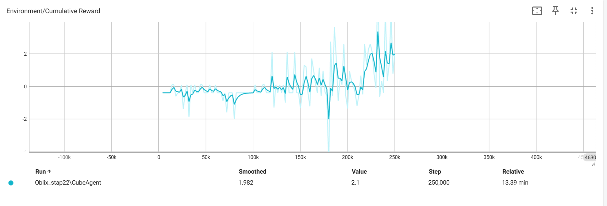

De agent behaalt meerdere hoge rewards en vertoont een duidelijke stijgende trend. De prestaties blijven stabiel in de tweede helft van de training zonder een grote zakken en je kan zien dat de strend linear stijgt. Om na te gaan of het niet 'lucky' was gaan we deze config en setting opnieuw proberen in een nieuwe training.

---

## Reproduceerbaarheid (Stap 23)

Dezelfde configuratie wordt opnieuw getest.

## Resultaten

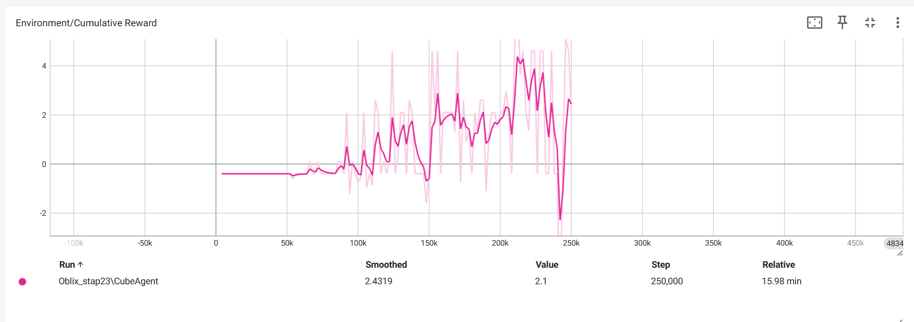

De resultaten bevestigen de vorige training. De agent behaalt opnieuw meerdere hoge rewards en eindigt positief. Dit toont aan dat de configuratie reproduceerbaar is ookal was er een korte grote dip op 242k stappen.

Dit zijn 22 en 23 bij elkaar.

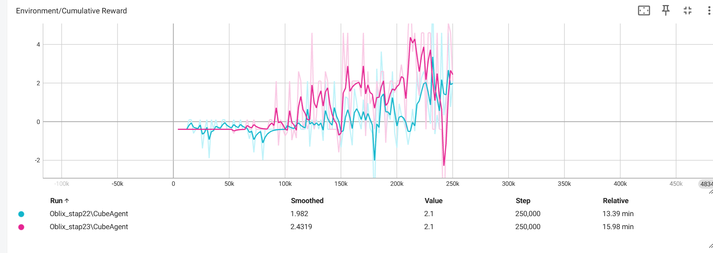

---

## Conclusie

Uit de resultaten kan geconcludeerd worden dat vooral de episode-lengte en PPO hyperparameters een grote invloed hebben op het leerproces van de agent.

Het verhogen van de Max Step naar 8000 gaf de agent voldoende tijd om de taak te voltooien. Daarnaast zorgde het verlagen van beta voor minder exploratie en een stabielere policy.

De beste resultaten werden behaald met volgende configuratie:

- learning_rate: 1.0e-4  
- beta: 5.0e-4  
- batch_size: 128  
- buffer_size: 4096  
- Max Step: 8000  

Deze configuratie toonde dus herhalende resultaten, waardoor deze configuratie + setting het beste waren voor dit project.

## Samenvatting gefaalde trainingen

Dit zijn alle gefaalde training samen op 1 grafiek.

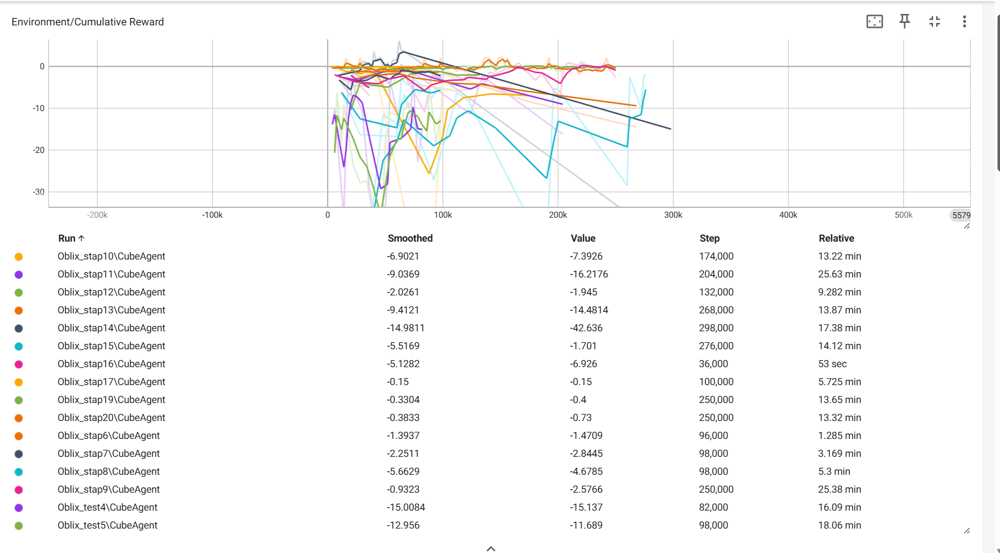

## Verrasende resultaten

De eerste drie testen verliepen heel positief, maar erna werd de agent verward in zijn taken en kreeg dan een zware daling.

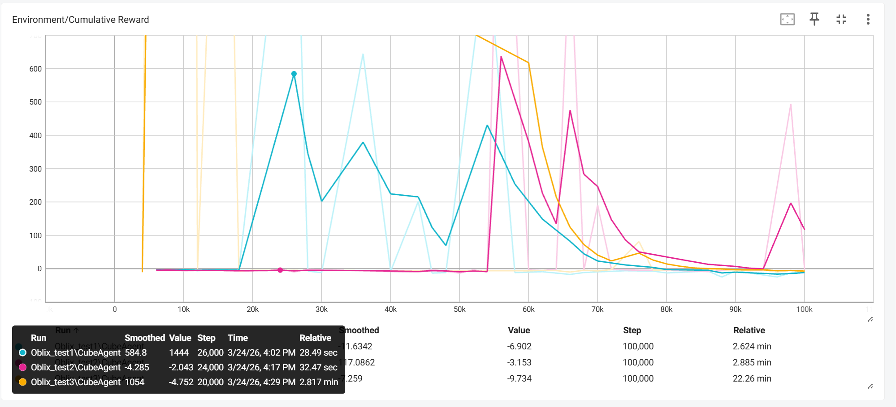

## Laatste conclusie

De laatste twee/drie runs waren het meest belovend met een lineare stijging van de trend.