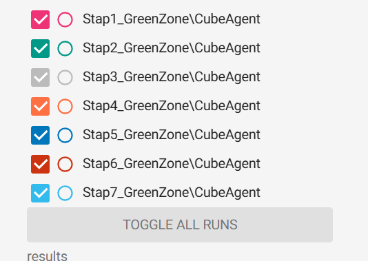
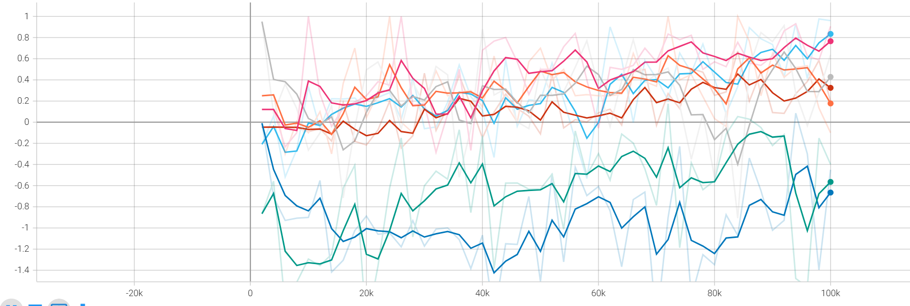
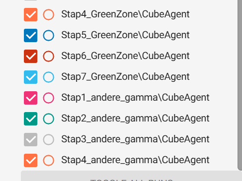
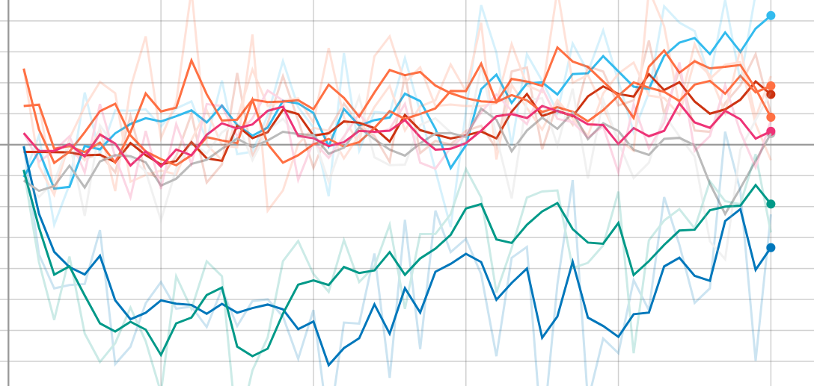
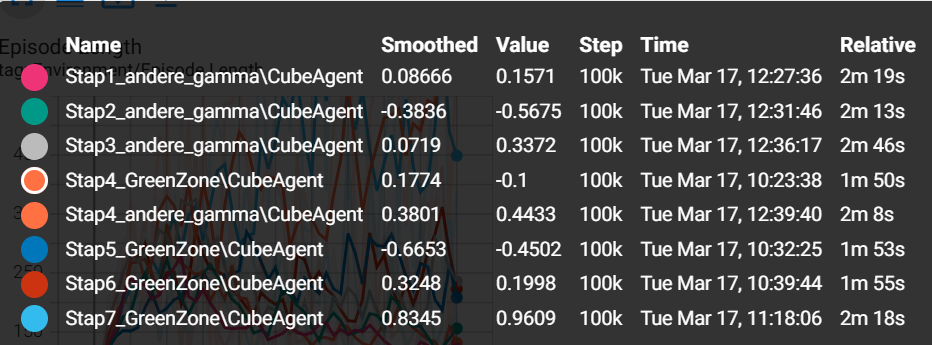

# Analyse van rewardaanpassingen bij een ML-Agent (rapport)

| S-nummer | s133070 |
##
| Gegenereerde getal | 3 |

## Inleiding

In dit verslag wordt er geanalyseerd hoe de ML-agent reageert op rewardaanpassingen. De agent wordt meerdere malen opnieuw getraind met verschillende rewardtoepassingen, zodat kan worden geanalyseerd welke aanpak de beste resultaten oplevert en of er grote verschillen zichtbaar zijn in de grafieken in Tensorboard. 

Het experiment wordt uitgevoerd in twee fases:
- Fase 1: enkel gebruik van ray perception sensors.
- Fase 2: gebruik van ray perception sensors gecombineerd met observaties.

## Methoden

De agent wordt meerdere keren opnieuw getraind met verschillende rewardinstellingen. Elke training wordt er naar de feedback gekeken die via de terminal wordt gelogt. Erna worden ook de grafieken in Tensorboard vergeleken met elkaar en ook de grafiek zelf wordt individueel beoordeeld.

De agent heeft als doel:
1. Het target te zoeken en aan te raken.
2. Daarna de green zone te bereiken en aan te raken.

De volgende rewardstructuren worden getest:

### Alleen met rays

- Stap 1:
  - Target: +0.8  
  - Green zone: +0.2  
  - Af platform: -0.5  
  - Straf per frame: geen  

- Stap 2:
  - Target: +0.8  
  - Green zone: +0.2  
  - Af platform: -0.5  
  - Straf per frame: -0.0005  

- Stap 3:
  - Target: +0.8  
  - Green zone: +0.2  
  - Af platform: -0.5  
  - Straf per frame: -0.00005  

### Rays + observaties

- Stap 4:
  - Target: +0.8  
  - Green zone: +0.2  
  - Af platform: -0.5  
  - Straf per frame: geen  

- Stap 5:
  - Target: +0.8  
  - Green zone: +0.2  
  - Af platform: -0.5  
  - Straf per frame: -0.0005  

- Stap 6:
  - Target: +0.8  
  - Green zone: +0.2  
  - Af platform: -0.5  
  - Straf per frame: -0.00005  

- Stap 7:
  - Target: +0.8  
  - Green zone: +0.2  
  - Af platform: -0.5  
  - Straf per frame: -0.00001  

## Grafieken

## Resultaten

Uit de grafieken blijkt dat er duidelijke verschillen zijn tussen de verschillende configuraties.

Bij de eerste fase wordt er een stijgende trend waargenomen, maar de resultaten blijven relatief instabiel. De agent behaalt soms hoge rewards, maar het gedrag is niet consistent.

Bij de tweede fase wordt een duidelijk verschil zichtbaar. De agent leert sneller en de gemiddelde reward ligt hoger. Vooral bij lagere strafwaarden per frame worden betere resultaten behaald.

De configuratie met een hoge negatieve reward (-0.0005) zorgt ervoor dat de agent voornamelijk negatieve scores behaalt en moeilijk leert. Dit is omdat de opbouw van de negatieve reward te hoog wordt. Dit komt doordat er gewerkt wordt met episodes van 2000 en als je dit gaat berekenen kom je op een negatieve reward van -1 uit na elke 2000 stappen.

De configuraties met kleinere negatieve rewards (-0.00005 en -0.00001) tonen een stabielere stijging en hogere eindwaarden. Op de grafieken kan je ook waarnemen dat de laatste stap, stap 7 het meest linear gedrag heeft.

## Conclusie

Op basis van de resultaten kan er geconcludeerd worden dat zowel observaties als de grootte van de negatieve reward een belangrijke invloed hebben op het leerproces van de agent.

Het toevoegen van observaties zorgt voor betere prestaties en een stabieler leerproces. Daarnaast blijkt dat een te grote negatieve reward het leerproces verstoort en leidt tot slechte resultaten.

De beste resultaten worden behaald met een zeer kleine negatieve reward (-0.00001) in combinatie met observaties. Deze configuratie biedt een goede balans tussen exploratie en optimalisatie, waardoor de agent een stabielere leercurve heeft.

# deel 2

## Inleiding

In dit deel van het verslag gaan we fase 2 opieuw uitvoeren, maar er zal nu een verandering plaats vinden in de config. We zetten de gamma van 0.99 naar 0.85. We gaan de resultaten vergelijken en ook bespreken. De stappen 4-7 van fase 2 worden dus vergeleken met nieuwe stappen 1-4 van een andere gamme-waarde

## Gamma

Gamma bepaalt hoeveel een toekomstige beloning waard is voor de agent. De waarde van gamma ligt altijd kleiner dan 1 en typische waarden liggen tussen 0.8 en 0.995.

Een hoge gamma-waarde betekent dat beloningen verder in de toekomst ook belangrijk zijn. Een lagere gamma-waarde legt meer nadruk op directe beloningen.

### fase 2 + andere gamma waarde (0.85)

- Stap 1:
  - Target: +0.8  
  - Green zone: +0.2  
  - Af platform: -0.5  
  - Straf per frame: geen  

- Stap 2:
  - Target: +0.8  
  - Green zone: +0.2  
  - Af platform: -0.5  
  - Straf per frame: -0.0005  

- Stap 3:
  - Target: +0.8  
  - Green zone: +0.2  
  - Af platform: -0.5  
  - Straf per frame: -0.00005  

- Stap 4:
  - Target: +0.8  
  - Green zone: +0.2  
  - Af platform: -0.5  
  - Straf per frame: -0.00001 

## Grafieken

## Resultaten

Uit de grafieken blijkt dat de aanpassing van de gamma-waarde naar 0.85 een merkbare invloed heeft op de prestaties van de agent.

Over het algemeen liggen de gemiddelde rewards lager in vergelijking met de oorspronkelijke gamma-waarde van 0.99. De stijgende trend is zwakker dan met een hogere gamma-waarde en de resultaten vertonen meer schommelingen.

Over heel het proces is stap 7 van deel de meest stabiele training/grafiek.

De configuraties met een lagere negatieve reward (-0.00005 en -0.00001) blijven ook bij deze gamma-waarde beter presteren dan de configuraties met een hogere straf, maar het verschil tussen de configuraties is minder uitgesproken dan bij gamma 0.99.

## Conclusie

Uit de resultaten kan geconcludeerd worden dat het verlagen van de gamma-waarde naar 0.85 een negatieve invloed heeft op de prestaties van de agent. De agent behaalt lagere gemiddelde rewards en het leerproces verloopt minder stabiel in vergelijking met een gamma-waarde van 0.99.

Dit komt doordat de agent met een lagere gamma-waarde minder rekening houdt met toekomstige beloningen. In dit onderzoek is het nadelig, aangezien de agent een opeenvolgende taak moet uitvoeren waarbij eerst het target wordt bereikt en daarna de green zone.

Hoewel de configuraties met een lagere negatieve reward ook bij deze gamma-waarde beter blijven presteren, kan je toch nog steeds waarnemen dat het algemene eindresultaat na een training lager lag dan met de hogere gamma-waarde

Hieruit kan geconcludeerd worden dat een hogere gamma-waarde toch voor dit onderzoek beter is.

